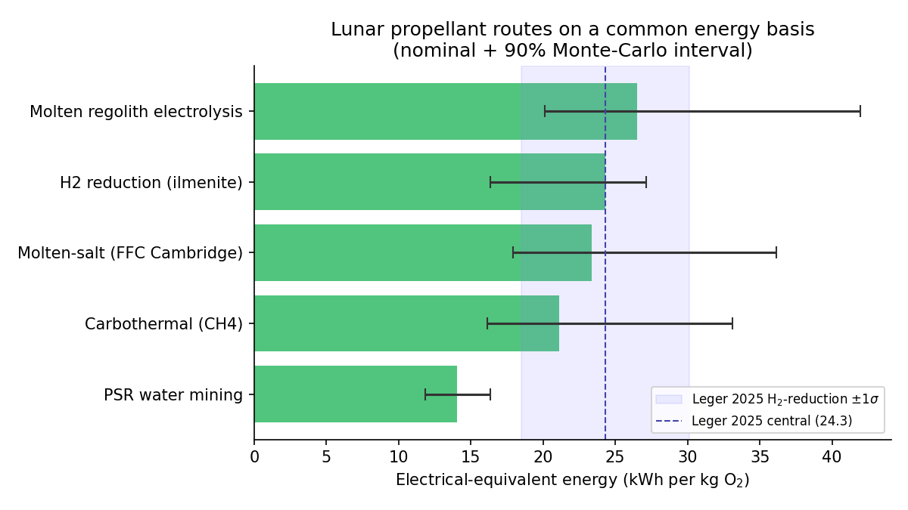
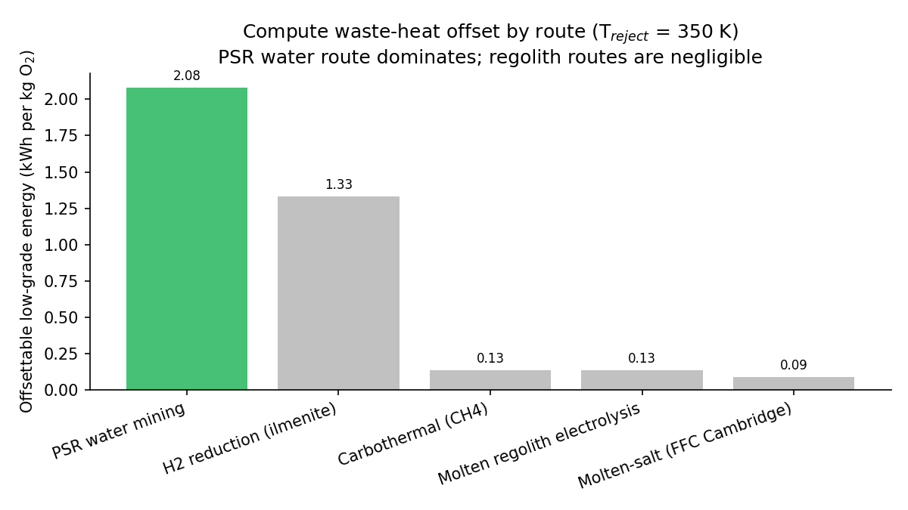
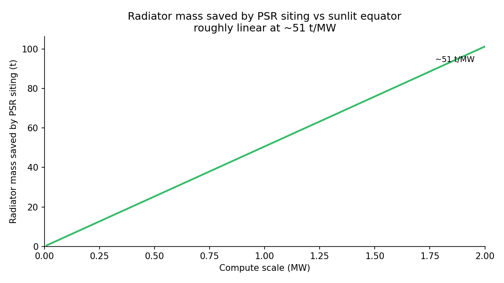

# A Common Electrical-Energy Basis for Comparing Lunar Oxygen and Propellant Production Routes

**Walter Kueffer**
Draft manuscript, version 0.9 (2026-05-30). Code, data, and all figures are reproducible
from the open-source model at https://github.com/dubthree/lunar-propellant-energy-model.

---

## Abstract

Lunar in-situ propellant production is widely proposed as the key to affordable cislunar
transport, yet the basic engineering question (which oxygen-extraction route costs the
least *energy* per kilogram of product) is hard to answer from the literature, because
published figures are reported on incompatible bases: hydrogen reduction as electrical
energy, carbothermal reduction as thermal energy, and molten regolith electrolysis (MRE)
with no published figure at all. Prior work compares subsets (Taylor and Carrier 1993
reviewed ~20 processes; Leger et al. 2025 modeled several on a common basis), but no
published comparison places all five of these routes, including the thermally-reported
carbothermal route and the two electrolysis routes that lack any published energy figure,
on a single electrical-equivalent basis with paired uncertainty propagation. We present a small, open,
uncertainty-quantified model that places five routes (hydrogen reduction, carbothermal
reduction, MRE, molten-salt electrolysis, and polar water-ice mining) on one
electrical-equivalent kWh/kg O2 basis under a single explicit system boundary, with
Monte-Carlo propagation of literature parameter ranges, including a continuous reactor
heat-loss term grounded in the only measured carbothermal datum (NASA CaRD). We check the
framework against the one route with a clean published electrical figure (hydrogen
reduction, Leger et al. 2025, 24.3 +/- 5.8 kWh/kg LOX): our nominal estimate (24.3) matches
Leger's central value, with the Monte-Carlo distribution centered somewhat lower (median
~21), reported as substantial interval overlap between two independent estimates. Using a
paired Monte Carlo that shares common parameters across routes, we report dominance
probabilities rather than overlapping error bars. The central finding is that **the polar
water-ice route is both the most energy-efficient (cheapest in 99% of paired trials) and the
only route that yields a complete LOX+LH2 propellant**. The reason is structural and, to our
knowledge, not previously quantified on a common basis: water mining is the only
low-temperature route (sublimation at ~273 K), so it alone escapes the large, continuous
reactor heat-loss penalty (~63-93 kWh-thermal/kg O2 in the one measured carbothermal
demonstration) that burdens every high-temperature thermochemical or electrochemical route.
Once that loss is charged, the high-temperature routes (carbothermal ~21, molten-salt ~23,
hydrogen reduction ~24, MRE ~27 kWh/kg O2) cluster well above the water route (~14) with
wide, overlapping uncertainty; molten regolith electrolysis is the most likely worst. A
sensitivity analysis identifies the single highest-value measurement for each route, we
translate energy into required surface power and landed fission-plant mass, and we outline
two companion analyses on reusing co-located compute waste heat (which is, fittingly,
most useful precisely at the low-temperature water route).

---

## 1. Introduction

The case for lunar propellant rests on energy: every process that turns regolith or polar
ice into liquid oxygen (and ideally liquid hydrogen) is energy-intensive, and surface
power is the binding constraint on any near-term architecture. Yet the comparison that
should drive route selection has never been made on equal footing. Three incompatibilities
recur in the literature:

1. **Thermal vs electrical energy are conflated.** Carbothermal reduction is reported as
   delivered thermal energy or "g O2/kWh thermal"; hydrogen reduction is reported as
   electrical kWh/kg. On the Moon both ultimately draw on the same scarce electrical
   supply, but they are not interchangeable at face value.
2. **System boundaries differ.** Some figures include excavation, beneficiation, and
   liquefaction; others count only the reactor.
3. **Two routes have no published figure at all.** Molten regolith electrolysis and
   molten-salt electrolysis are described qualitatively; their energy cost is asserted,
   not quantified.

The consequence is that capital allocation, power-plant sizing, and architecture choice
rest on a comparison that does not exist. This is a modeling gap, not a hardware gap,
which is precisely why it can be closed now, cheaply, and reproducibly. We build that
comparison and quantify its uncertainty.

## 2. Methods

### 2.1 Functional unit and system boundary

We compute the **electrical-equivalent energy in kWh per kg of O2 delivered to cryogenic
storage**, and additionally report kWh per kg of total propellant for the one route that
co-produces hydrogen. The system boundary is a fixed sequence of stages; every route
enables a subset, using the same stage sub-models, so all differences between routes arise
from parameters rather than inconsistent accounting:

excavation/acquisition -> beneficiation -> heating (sensible, plus fusion for melt routes)
-> reaction (reduction enthalpy or Faradaic electrolysis) -> product cleanup -> water
electrolysis (where the route produces H2O) -> gas compression -> liquefaction (LOX
always; LH2 where hydrogen is retained).

### 2.2 Thermal-to-electrical conversion

To compare a thermally-reported route against electrically-reported ones, all thermal
demand is converted to electrical-equivalent through an explicit electric-to-thermal
efficiency parameter (resistive heating, nominal 0.90). This single, visible knob is what
makes the comparison honest; a solar-thermal heating pathway would be a separate
sensitivity, not the baseline.

### 2.3 Uncertainty propagation

Every uncertain input is a triangular `(low, nominal, high)` distribution sourced from the
literature (the full parameter table, with a citation on every value, is in `params.py`).
A 20,000-trial Monte Carlo propagates these to a 90% interval per route. We propagate
stated literature ranges, not assumed Gaussian measurement error. The electrolysis cell
voltage and current efficiency of the electrochemical routes are sampled with a physical
anti-correlation (a shared operating-severity latent: higher current density raises voltage
and lowers efficiency together), avoiding unphysical parameter corners.

### 2.4 Ranking by paired Monte Carlo

Reading a ranking from five marginal error bars is a statistical error, because the routes
share parameters (regolith specific heat, heat recuperation, electrolysis efficiency,
liquefaction) that must take the same value in any given world. We therefore run a paired
Monte Carlo: one shared parameter draw per trial across all routes, evaluated trial by
trial, so we can report P(route A cheaper than route B) and P(route is cheapest / worst).

### 2.5 Continuous reactor heat loss

A reactor held continuously at 800-1900 C radiates and conducts heat to its surroundings
independently of the per-kg sensible heating, a term the sensible-heat-only stages omit.
The only measured carbothermal datum (NASA's CaRD brassboard) implies ~63-93 kWh-thermal
per kg O2 for the reduction step, dominated by this loss at demonstrated (tiny) scale. A
scaled, well-insulated plant amortizes it over far more throughput, so the true value is
highly scale-dependent. We therefore add a single reactor-loss term (log-uniform, nominal
8, range 2-30 kWh/kg O2: 2 for a large well-insulated plant, ~30 approaching the brassboard
upper bound) to the four high-temperature routes. The low-temperature water route
(sublimation at ~273 K) is exempt. Hydrogen reduction is also exempt *in modeling* because
it is calibrated to Leger 2025, whose full-chain figure already reflects realistic reduction
energy; charging it a separate loss term would double-count and break that validation. This
term, omitted in an earlier version of the model, is what previously made carbothermal
appear cheapest.

## 3. Validation

### 3.1 Hydrogen reduction against Leger 2025 (and a second anchor)

Hydrogen reduction is the only route with a clean published electrical figure: 24.3 +/-
5.8 kWh/kg LOX, with the reduction step ~55% and water electrolysis ~38% of the total
[leger2025]. We built our estimate bottom-up from first principles and independent
parameters; the largest tunable term (water-electrolysis efficiency) is set from an
independent SOEC source [hauch2020; iea2019], not from Leger's implied value.

- Nominal point estimate: **24.3 kWh/kg LOX**, matching Leger's central value and inside
  his 1-sigma interval [18.5, 30.1].
- The Monte-Carlo distribution is centered lower (median ~21, mean ~22): Leger's value sits
  near our 85th percentile, not our center. We therefore report agreement as substantial
  **interval overlap** between two independent estimates, not as a point match; the nominal
  coincidence should not be over-read.
- Stage shares match: heating + reaction ~65% (Leger ~55%); water electrolysis ~30%
  (Leger ~38%).
- A second cross-check: Taylor and Carrier (1993) place the route at ~26 kWh/kg LOX
  (cross-technology range 18-35) [taylor1993].
- Because the model omits several one-signed terms (Section 9) that would raise totals, the
  nominal agreement with Leger and the lower distribution center are both consistent with the
  two estimates sharing a partial system boundary; we do not claim the absolute level is
  converged.

### 3.2 MRE against Carr 1963 and terrestrial molten-oxide electrolysis

MRE began as a pure first-principles estimate (nominal 26.5, 90% CI [20.1, 42.0], now
including the reactor-loss term). Because it has no published electrical figure, we
cross-check it against three
sources that unavoidably use *different system boundaries*, so the agreement is weak and
bounding rather than a clean anchor: Carr (1963), as reported secondarily by Schreiner
(2016), gives ~26.4 kWh/kg O2 for lunar MRE [carr1963]; terrestrial molten-oxide
electrolysis of iron runs ~3.7-4.0 MWh/t metal, i.e. ~9 kWh/kg O2, a well-insulated lower
bound for a different chemistry [allanore2015]; and NASA reactor-sizing models place
*whole-system* figures (including Joule heating and duty cycle, which our standalone-reactor
boundary excludes) at ~50-120 kWh/kg O2 [schreiner2016sizing]. Our estimate falls between these,
which given their ~9-120 spread is corroboration only in a loose sense. We did, however,
correct the oxide-melt current efficiency to match *measured* regolith-surrogate data
(70-90%, Ir anodes [allanore2015]) rather than an optimistic assumption, a change that
lowered MRE's estimate against the prior narrative.

These are the project's falsifiable tests (`tests/test_validation.py`). Only hydrogen
reduction has a like-for-like published electrical figure; the others are first-principles
estimates reported with wide intervals and as probabilities, not point claims.

## 4. Results

**Table 1.** Electrical-equivalent energy per route (20,000 trials).

| Route | Yields | kWh/kg O2 (nominal) | 90% CI | kWh/kg propellant |
|---|---|---|---|---|
| PSR water mining | LOX+LH2 | 14.0 | 11.8-16.4 | **12.5** |
| Carbothermal (CH4) | LOX | 21.1 | 16.1-33.1 | 21.1 |
| Molten-salt (FFC) | LOX | 23.3 | 17.9-36.2 | 23.3 |
| H2 reduction (ilmenite) | LOX | 24.3 | 16.4-27.1 | 24.3 |
| Molten regolith electrolysis | LOX | 26.5 | 20.1-42.0 | 26.5 |

The single value is the deterministic nominal (all parameters at their cited value); for
the right-skewed routes the Monte-Carlo median can differ by a few kWh/kg, so for plant
sizing prefer the median and the interval. The four high-temperature routes carry the
reactor heat-loss term (Section 2.5) and so have wide, strongly overlapping intervals;
they are not cleanly separable from one another. The water route stands apart below them.



**Figure 1.** The five routes on a common electrical-energy basis (nominal + 90%
Monte-Carlo interval); the shaded band is Leger 2025's 1-sigma for hydrogen reduction.

**Table 2.** Paired-Monte-Carlo dominance.

| Route | P(cheapest) | P(worst) |
|---|---|---|
| PSR water mining | 0.99 | 0.00 |
| Carbothermal (CH4) | 0.01 | 0.00 |
| H2 reduction (ilmenite) | 0.01 | 0.09 |
| Molten-salt (FFC) | 0.00 | 0.15 |
| Molten regolith electrolysis | 0.00 | 0.76 |

The water route is the cheapest in 99% of paired trials and beats every high-temperature
route in >95%. Among the high-temperature routes MRE is the most likely worst (0.76),
driven by its reactor loss and cell voltage; the rest are not cleanly separable. The water
route is essentially never the worst.

## 5. Sensitivity analysis

A one-at-a-time tornado analysis (each parameter swept low-to-high, all others nominal;
`python -m lpem --sensitivity <route>`) identifies the dominant uncertainty for each route
and, with it, the single highest-value measurement:

| Route | Dominant driver (swing, kWh/kg O2) | Next |
|---|---|---|
| PSR water | **LH2 liquefaction (6.0)** | electrolysis eff (2.4), ice grade (1.0) |
| Carbothermal | **reactor heat loss (28.0)** | reaction enthalpy (3.5), electrolysis eff (2.4) |
| Molten-salt | **reactor heat loss (28.0)** | current efficiency (5.6), cell voltage (4.5) |
| MRE | **reactor heat loss (28.0)** | cell voltage (15.9), yield (3.8) |
| H2 reduction | O2 yield (13.3) | heat recuperation (9.1), cp (5.3) |

Two practical conclusions. First, the reactor heat-loss term dominates the uncertainty of
all three high-temperature routes that carry it; reducing it (better insulation, larger
throughput to amortize standing loss) is the single highest-value engineering lever, and
measuring it at relevant scale is the highest-value measurement this model identifies (the
only datum today is the loss-dominated CaRD brassboard). Second, the water route's verdict
hinges on small-scale LH2 liquefaction, a comparatively well-characterized term. The
*ranking* is robust: the water route's lead over every high-temperature route survives
across the parameter ranges, precisely because its advantage (no high-temperature reactor)
is structural rather than parametric.

## 6. Findings

**Finding 1: The low-temperature polar water route is the most energy-efficient AND the
only full-propellant route.** It is the cheapest in 99% of paired trials (14.0 kWh/kg O2,
12.5 per kg of propellant) and is essentially never the worst. The mechanism is structural:
water mining operates at the ~273 K sublimation point, so it is the only route that does
not run a hot reactor and therefore the only one that escapes the continuous reactor
heat-loss penalty (Section 2.5) that burdens every thermochemical and electrochemical
route. It is also the only route that co-produces usable hydrogen, yielding a complete
LOX+LH2 propellant rather than LOX with fuel shipped from Earth. The water route therefore
wins on both axes at once. The caveat is honest and route-specific: its dominant cost is
small-scale LH2 liquefaction and (out of this boundary) months-long zero-boil-off storage
at 20 K, which could erode but not plausibly erase a >40% energy margin.

**Finding 2: Every high-temperature route carries a large, scale-uncertain reactor
heat-loss penalty; this is what was missing when carbothermal earlier appeared cheapest.**
Carbothermal (21.1), molten-salt (23.3), hydrogen reduction (24.3), and MRE (26.5) cluster
together with wide, strongly overlapping intervals and are not cleanly separable; MRE is
the most likely worst (P 0.76), driven by its reactor loss and full decomposition voltage
(~3.5 V, not the ~1.7 V thermodynamic floor nor the 16-34 V Joule-heating voltages quoted
in concept papers). An earlier version of this model omitted continuous reactor heat loss
and consequently found carbothermal "cheapest"; the only measured carbothermal datum (NASA
CaRD, ~63-93 kWh-thermal/kg O2 for the reduction step, loss-dominated at demonstrated
scale) shows that omission was decisive. We charge a de-rated, wide-range loss term to the
four high-temperature routes; hydrogen reduction is the exception in modeling only because
it is anchored to Leger 2025, whose full-chain figure already reflects realistic reduction
energy (charging it again would double-count and break that validation).

**Finding 3: The honest separation is low-temperature vs high-temperature, not chemistry.**
The dominant energy distinction across all five routes is not the specific extraction
chemistry but the operating temperature: one low-temperature route (water, ~14) sits far
below a cluster of four high-temperature routes (~21-27) whose differences are smaller than
their shared reactor-loss uncertainty. For an architect, that reframes route selection: the
first-order energy lever is avoiding a high-temperature reactor (or driving down its
standing loss), not picking among reduction chemistries.

## 7. From energy to power plant and landed mass

Energy matters through what it costs to supply. Converting kWh/kg into continuous surface
power and the landed mass of the fission-surface-power (FSP) system it implies
(`lpem.arch`), even a modest 50 t O2/yr plant requires ~90-170 kWe, one to ~1.7 units of
NASA's planned 100-kWe FY2030 reactor (the cited 40-kWe concept [oleson2022fsp] scaled up).
Route choice swings landed power-system mass by ~18 t for the same oxygen output: the
low-temperature water route needs ~20 t of FSP, while the high-temperature routes need
~30-38 t (carbothermal ~30, MRE ~38), again because of their reactor-loss burden. The
direction is robust; the magnitude scales with the FSP specific mass and assumes an
all-fission architecture (a solar-plus-storage plant would be dominated by night-survival
storage mass, not modeled here).

## 8. Companion analyses (compute waste-heat integration)

Two companion analyses, kept modular, examine reusing co-located compute waste heat:

- **Low-grade thermal offset** (`WASTE-HEAT-OFFSET.md`). By the Second Law, compute waste
  heat (~330 K) can supply only low-grade ISRU demand. At the nominal 350 K reject
  temperature, comfortably above the ~273 K sublimation target, it can in principle cover
  the water route's full thermal-mining term (~2.1 kWh/kg O2, ~14% of the route; Figure 2);
  this offset falls off sharply and excludes the sublimation enthalpy if compute rejects
  below ~273 K. It cannot supply high-grade reduction/electrolysis heat at all.

  

  **Figure 2.** Low-grade, waste-heat-offsettable energy per route (T_reject = 350 K).

- **PSR co-location** (`PSR-COLOCATION.md`). A permanently shadowed region is both a
  cryogenic radiative sink for compute and the location of the water resource. Under an
  explicit radiator energy balance, PSR siting saves (over feasible cases) a median ~29 t
  of radiator mass per MW of compute (IQR ~18-49; Figure 3); in ~30% of sampled conditions
  a sunlit 330 K radiator cannot reject at all without active cooling, an extreme form of
  the same advantage that we report as a feasibility fraction rather than fold into a
  point estimate. The heat cascade itself is a modest bonus (saves ~2.7 t reactor for the
  reference plant; the break-even enabling probability is ~38% at nominal but ~47% when
  propagated, with P(worthwhile once co-located) ~85%); co-location is justified by the
  compute siting economics, not the cascade. This is, fittingly, most useful at the
  low-temperature water route that Finding 1 already favors.

  

  **Figure 3.** Radiator mass saved by PSR siting vs a sunlit site at nominal parameters
  (slope ~51 t/MW); the Monte-Carlo feasible-case median is lower (~29 t/MW) because the
  saving is right-skewed and ~30% of sampled sunlit designs cannot reject at all.

## 9. Limitations

- Steady-state production energy, power, and FSP landed mass only; capital cost, mobility,
  comms, site logistics, and demand are out of scope.
- Omitted energy terms are one-signed (they raise totals): standing radiative loss from
  continuously hot reactors (worst for the hottest route, MRE), comminution/beneficiation,
  electrolyzer heat-rejection parasitics, and, for the water route, months-long LH2
  zero-boil-off and power delivery into permanent shadow. Absolute kWh/kg figures are best
  read as lower bounds; the ranking is more robust than the levels.
- Three of five routes lack a direct independent electrical anchor.
- O2 yield and reaction temperature are sampled independently (a residual idealization).
- Site geography and solar-thermal process heat are not modeled.

## 10. Reproducibility

```
pip install -e .
python -m lpem                 # Table 1
python -m lpem --dominance     # Table 2
python -m lpem --sensitivity mre   # Section 5 tornado
python -m lpem --plant-tonnes 50   # Section 7
python -m lpem --waste-heat --benefit   # Section 8
python scripts/make_figures.py     # Figures 1-3
pytest                         # 48 tests, incl. the validation anchors
```

## References

See `paper/REFERENCES.md` (full bibliography with DOIs/URLs) and `paper/references.bib`.
Key sources: Leger et al. 2025 (PNAS) [leger2025]; Taylor & Carrier 1993
[taylor1993]; Carr 1963 [carr1963]; Allanore 2015 (J. Electrochem. Soc.)
[allanore2015]; Schreiner et al. 2016 (Adv. Space Res.) [schreiner2016sizing]; Kornuta et al.
2019 (REACH) [kornuta2019]; Hauch et al. 2020 (Science) [hauch2020]; Colaprete et al. 2010
(Science) [colaprete2010].
