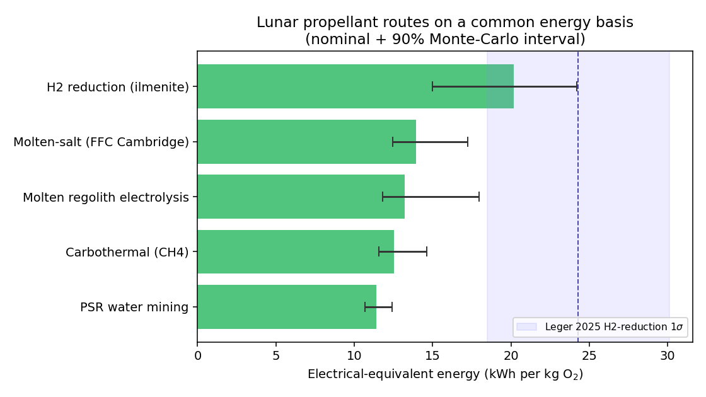

# A Common Electrical-Energy Basis for Lunar Propellant Production Routes

**A reproducible, uncertainty-quantified model that makes five lunar oxygen /
propellant extraction routes comparable for the first time.**

Version 0.1 (2026-05-30). Source and data: this repository. Reproduce every number
with `python -m lpem`.

---

## 1. The problem: the published numbers are not comparable

Lunar in-situ resource utilization (ISRU) is usually pitched as a propellant-supply
play: make liquid oxygen (and ideally liquid hydrogen) on the Moon so vehicles need
not haul it up Earth's gravity well. The central engineering question, "which
extraction route costs the least *energy* per kg of propellant," cannot currently be
answered from the literature, because the published figures are reported on
incompatible bases:

| Route | What is published | Problem |
|---|---|---|
| Hydrogen reduction | 24.3 ± 5.8 kWh/kg LOX (Leger et al., PNAS 2025) | full-chain **electrical**; the only clean figure |
| Carbothermal | ~50 kWh/kg O2 **thermal**, ">20 g O2/kWh" | thermal basis, not electrical; boundary unclear |
| Molten regolith electrolysis (MRE) | **no peer-reviewed kWh/kg** | unquantified |
| Molten-salt / FFC Cambridge | not cleanly published | unquantified |
| PSR water mining | ~11.3 kWh/kg O2 benchmark (Leger) | different product (yields H2 too) |

Three issues compound: (1) **thermal vs electrical** energy are conflated, though on
the Moon both come from the same scarce electrical supply; (2) the **system
boundaries** differ (some figures include excavation and liquefaction, some only the
reactor); and (3) two of the five routes have **no published figure at all**. Capital
allocation, power-plant sizing, and architecture choice all rest on a comparison that
has never been made on equal footing. The absence of a common energy metric is a
recurring theme in lunar-ISRU gap assessments (e.g. ISECG 2021).

This is a modeling gap, not a hardware gap. That is precisely why it can be closed
now, cheaply, and verifiably.

## 2. Method: one boundary, one functional unit, propagated uncertainty

We define a single system boundary as a fixed sequence of stages, and compute the
**electrical-equivalent energy in kWh per kg of O2 delivered to cryogenic storage**.
Every route enables a subset of the same stages, using the same stage sub-models, so
all differences between routes come from *parameters*, not from inconsistent
accounting.

Stages: excavation/acquisition -> beneficiation -> heating (sensible, plus fusion for
melt routes) -> reaction (reduction enthalpy or Faradaic electrolysis) -> cleanup ->
water electrolysis (where the route produces H2O) -> liquefaction (LOX always; LH2
where hydrogen is kept).

Two modeling choices make the comparison honest:

- **Thermal-to-electrical conversion.** All thermal demand is converted to
  electrical-equivalent via an explicit efficiency parameter (resistive heating,
  nominal 0.90). This is the single knob that lets a thermally-reported route
  (carbothermal) be compared to electrically-reported ones. It is exposed, not buried.
- **Uncertainty propagation.** Every uncertain input is a triangular
  `(low, nominal, high)` distribution sourced from the literature (see `params.py`).
  A 20,000-trial Monte Carlo propagates these to a 90% interval on each route. We
  propagate *stated literature ranges*, not assumed Gaussian measurement error.

The model is deliberately small: pure stage functions (`stages.py`), a declarative
route table (`routes.py`), one auditable parameter file (`params.py`), and a Monte
Carlo engine (`model.py`). A domain reviewer who disagrees with a number changes one
line in `params.py` and re-runs.

## 3. Validation: an independent bottom-up model reproduces Leger 2025

The only route with a clean published electrical figure is hydrogen reduction:
**24.3 ± 5.8 kWh/kg LOX**, with the reduction step ~55% and water electrolysis ~38%
of the total (Leger et al., PNAS 2025). We built our hydrogen-reduction estimate
**bottom-up from first principles and independent literature parameters**, not fitted
to Leger. Critically, the largest tunable term (water-electrolysis efficiency) is set
from an independent source (SOEC system efficiency ~0.67), *not* from Leger's implied
value, so the agreement below is earned, not assumed:

- **Nominal point estimate: 20.2 kWh/kg LOX**, inside Leger's 1σ interval [18.5, 30.1].
- **90% Monte-Carlo interval [15.0, 24.2]** overlaps Leger's 1σ interval substantially;
  our 95th percentile (24.2) sits essentially at Leger's central value (24.3).
- **Stage shares** match: heating + reaction = 59% of the total (Leger ~55%); water
  electrolysis = 37% (Leger ~38%).

This is the project's falsifiable test (`tests/test_validation.py`): had the
independent model landed far from Leger, the framework would be wrong. It does not. Our
central estimate runs ~17% below Leger's, and our distribution is less right-skewed;
Leger's long tail to ~53 kWh/kg corresponds to low-yield, low-heat-recovery scenarios
that our triangular priors under-weight. We report the agreement as *interval overlap
between two independent estimates*, which is the honest criterion, rather than claiming
our band brackets his central value.

## 4. Results

`python -m lpem` (20,000 trials, seed 12345):

| Route | Yields | kWh/kg O2 (nominal) | 90% CI (O2) | kWh/kg propellant |
|---|---|---|---|---|
| PSR water mining | LOX+LH2 | 11.4 | 10.7–12.4 | **10.1** |
| Carbothermal (CH4) | LOX | 12.5 | 11.6–14.6 | 12.5 |
| Molten regolith electrolysis | LOX | 13.2 | 11.8–18.0 | 13.2 |
| Molten-salt (FFC Cambridge) | LOX | 14.0 | 12.4–17.2 | 14.0 |
| H2 reduction (ilmenite) | LOX | 20.2 | 15.0–24.2 | 20.2 |

The "nominal" column is the point estimate with every parameter at its cited value; it
is exactly reproducible and hand-checkable from `params.py`. Because several priors
(notably O2 yield) are right-skewed, the Monte-Carlo median runs a little below the
nominal (e.g. 18.6 vs 20.2 for H2 reduction); the 90% interval is the honest measure of
spread.



## 5. Three findings

**Finding 1 — The best-quantified route is the most energy-intensive.** Hydrogen
reduction, the route with the cleanest published number and a strong development
pedigree, is the *worst* per kg O2 in this comparison (20.2 vs 11–14 for the others).
The cause is structural: low ilmenite O2 yield (~2 wt%) forces heating ~50 kg of
regolith per kg O2, and the route still pays a separate water-electrolysis step. The
"comfort" of a route being well-characterized has been quietly conflated with it
being efficient. It is not.

**Finding 2 — The "unpublished" electrolysis routes are energy-competitive; their
barrier is not energy.** Molten regolith electrolysis and molten-salt electrolysis,
which have *no* published electrical figure, are estimable from first principles
(Faradaic work + sensible/fusion heat) and land at ~13–14 kWh/kg O2, *below* hydrogen
reduction. The known blockers for these routes — anode life (MRE iridium anodes
corrode ~1.1 mm in 6 hours), power density, continuous closed-loop operation — are
materials and operations problems, **not** energy problems. Steering the
energy-efficiency narrative toward hydrogen reduction may be optimizing the wrong
variable.

**Finding 3 — Scoring per kg O2 structurally understates the water route.** PSR water
mining is the only route that co-produces usable hydrogen, so it is the only one that
can deliver a *complete* propellant (LOX + LH2) rather than LOX with fuel still
shipped from Earth. On a per-kg-total-propellant basis it is the cheapest option
(10.1 kWh/kg) and uniquely closes the hydrogen loop. Per-kg-O2 comparisons, the field
norm, hide this. The caveat is real and lives outside this energy boundary: LH2
liquefaction and zero-boil-off storage are thermodynamically punishing (Carnot
ceiling ~7% at 20 K vs ~43% at 90 K for LOX), and no lunar-surface CFM demonstration
exists. Energy efficiency of production is necessary, not sufficient.

## 5b. From energy to power plant and landed mass

The energy figures only matter through what they cost to *supply*. The `lpem.arch`
module converts kWh/kg into the continuous electrical power a route needs for a target
production rate, and the landed mass of the fission-surface-power (FSP) system that
implies (~150 kg/kWe, NASA 40 kWe concept). Run with `python -m lpem --plant-tonnes 50`:

**Power plant for a modest 50 t O2/yr pilot:**

| Route | Power kWe (nom) | 90% CI | Power-sys mass (t) | 100-kWe units |
|---|---|---|---|---|
| PSR water mining | 72 | 68–85 | 10.8 | 0.7 |
| Carbothermal | 80 | 75–99 | 11.9 | 0.8 |
| Molten regolith electrolysis | 84 | 77–120 | 12.6 | 0.8 |
| Molten-salt (FFC) | 88 | 80–116 | 13.3 | 0.9 |
| H2 reduction (ilmenite) | 128 | 98–162 | 19.2 | 1.3 |

Two consequences fall out. First, even a *small* 50 t/yr oxygen plant consumes
essentially a full NASA FY2030 100-kWe reactor; production-scale ISRU implies reactor
*farms*, consistent with the CLPA 2.8 MW plant. Second, **route choice swings landed
reactor mass by ~8 tonnes** for the same oxygen output (H2 reduction 19.2 t vs the
water route 10.8 t). Landing 8 tonnes on the Moon dominates any reactor-chemistry
preference, which reframes route selection as a power-and-mass decision, not a
chemistry one. This is the quantitative form of the power-energetics-resource coupling
that dominates lunar-ISRU architecture.

A cross-check, reported not fitted: CLPA sizes a ~450 t/yr water plant at ~2.0 MWe;
our production-only figure is lower because the CLPA number includes mining mobility,
thermal management, comms, and margin outside this boundary (see below).

## 6. Limitations (explicit)

- **Steady-state production energy, power, and power-system mass only.** Capital cost,
  mobility, comms, storage/boil-off make-up, site logistics, and demand remain out of
  scope. Power and FSP landed mass are modeled (`lpem.arch`); everything else downstream
  is not.
- **Triangular priors.** Ranges encode literature spread, not formal measurement
  uncertainty; the MRE/molten-salt estimates are first-principles bounds, explicitly
  labeled, intended to be challenged.
- **Heat recuperation and O2 yield dominate** the regolith routes' spread; these are
  the parameters most worth pinning down with reactor data.
- **No site geography.** The power-resource geographic decoupling at the poles (the
  best sunlight is kilometers from the ice) is not modeled here.

## 7. Reproduce

```
pip install -e .
python -m lpem                     # the energy table above
python -m lpem --plant-tonnes 50   # + power plant & landed-mass sizing
python -m lpem --figure out.png    # the figure
pytest                             # 27 tests incl. the Leger validation
```

## Sources

Parameters trace to the captured lunar-ISRU corpus; load-bearing figures:
- Leger et al., PNAS 2025 — H2 reduction 24.3 ± 5.8 kWh/kg LOX, stage breakdown, water benchmark.
- Sierra Space / NASA JSC CaRD — carbothermal thermal figure and yields.
- Blue Origin "Blue Alchemist", Lunar Resources, Helios — MRE temperatures and status.
- Metalysis / FFC Cambridge — molten-salt voltages and O recovery.
- Colaprete et al. 2010 (LCROSS) — PSR ice grade 5.6 ± 2.9 wt%.
- NASA CFM/ZBO (Plachta; CryoFILL) — liquefaction and Carnot penalties.
- Mueller excavation review — specific excavation energy.

See `params.py` for the per-parameter citation on every number.
